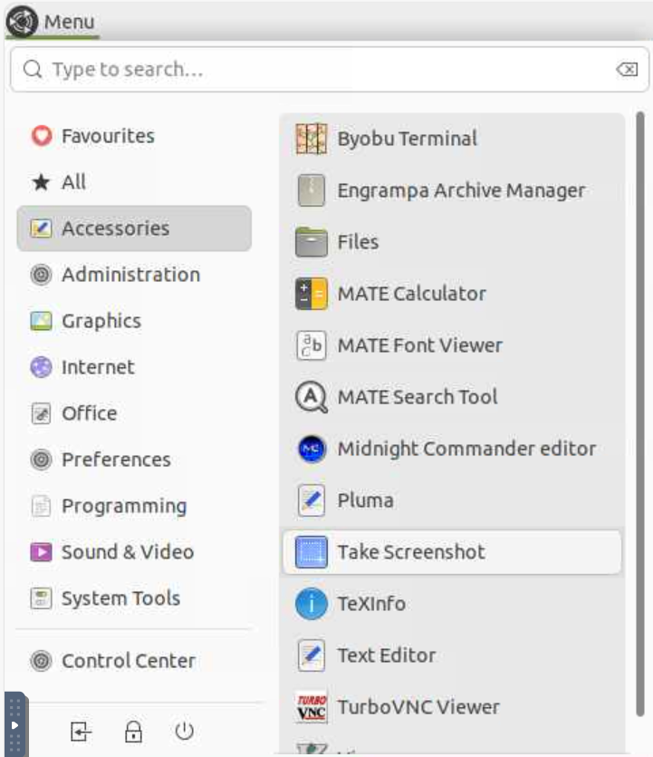

# Lab 2: ROS Tutorials and Bag Playback

## Introduction

Autonomous vehicles have many processes running simultaneously.  These include processes that acquire sensor data, process the data, monitor the ego-vehicle, monitor the environment, plan routes and control the brakes, acceleration and steering.  An important problem is how can these processes, most of which are running asynchronously, communicate with each other and what sort of messages do they send each other?  Well, that is the job of ROS.  

Next week we'll introduce ROS, but in perparation of that, the goal of this lab is to explore basic ROS functionality.  We will use online tutorials.  These use simplified models, such as 2D turtles, but the principles of sending velocity commands and recording their motions, and playing back their motions is the same as used when developing real autonomous vehicles.  

## Setup

You should have ROS Jazzy working on your HPCC account and have set your `ROS_DOMAIN_ID` in your `.rosinit` file with your individual number given to you on D2L.  When you type `source ~/.rosinit`, it will output the value of your `ROS_DOMAIN_ID` and this must not be zero, but rather match your assigned number.  This is important so you don't conflict with other students.

There is good [online documentation[(https://docs.ros.org/en/jazzy/)] for ROS.  Notice in the bottom left you can specify which version of ROS.  We will mostly be using Jazzy, which is the latest long-term support (LTS) version.  

Finally, HPCC has a screenshot tool which you can access as shown here:




# Exercise 1: ROS Messages, Topics and ROS Bags (5 Points)

Step through and and try all the commands in Section 3.1 of [autonomous-vehicles](https://gitlab.msu.edu/av/autonomous-vehicles) titled [ROS Messages, Topics and ROS Bags](https://gitlab.msu.edu/av/autonomous-vehicles/-/blob/2025/ROS/Messaging.md).  You'll replay a ROS bag collected from the MSU Canvas vehicle and visualize the image and LiDAR contents of it.  When you reach the last step, make a screen shot of the RViz output showing the vehicle TF tree as well as the LiDAR points.  Save this as `rviz_output.png`.

# Exercise 2:  ROS Client Tools Tutorials (5 Points)

Do nine of the ten [Beginner CLI Tools](https://docs.ros.org/en/jazzy/Tutorials/Beginner-CLI-Tools.html) tutorials; all except the first tutorial "Configuring environment", as your ROS environment is already configured.  

Note that all the packages are pre-installed on HPCC, so do **not** do any `sudo apt install` commands (as shown in some of the tutorials).  You do not have sudo privileges on HPCC.  

It is very helpful to remember ROS commands.  So, while it is possible to copy and paste the ROS commands, do not do this.  Instead, **type out each ROS command** in your terminal.  That will do much more to make you comfortable working with ROS than if you paste the commands.  

## Exercise 2 Submission

Do the following submission after you have completed all nine tutorials.  Make sure you have cloned your `<student_repo>`.

Create a folder inside your `<student_repo>` called `lab2_tutorials` and do the following steps: 
1. Start a fresh `turtlesim_node` simulation and position your turtle in the center of the window **pointing to the right**
2. Start recording a ROS bag called `figure_eight` that records only the topic `/turtle1/cmd_vel`. 
3. Navigate the turtle around in a rough figure-eight shape that covers the window using teleoperation 
4. Close the ROS bag  
5. Make a screen capture of the turtle window called `figure_eight.png` which should look approximately like this: 


6. Restart your `turtlesim_node` and position your turtle in the center of the window **pointing down**
7. Play the rosbag you just recorded.  
8. When it is done, make a screen capture of the replayed turtle path called `figure_eight_replay.png`.  
9. Compare the original and replayed model.  Is the shape the same or different?  Make sure you understand why they are different.  Hint: think about what topic is being recorded in the ROS bag.
  
___
# What to submit:
- `figure_eight.png`: the screen capture of the first figure eight run
- `figure_eight_replay.png`: the screen capture of a replay of the rosbag controlling the turtle.
- `rviz_output.png`: the screen capture of RViz.

When these 3 files are inside your `lab2_tutorials` folder, submit it as follows:
```
cd <student_repo>\lab2_tutorials
git add .
git commit -m "Add a comment here"
git push
```
Do not forget to `push`, or your lab will not be submitted.

# Due Date:

Due 2:30pm Thursday September 11, 2025.
