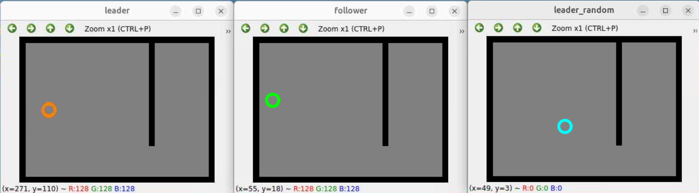

# Lab 3 - Robot Operating System (ROS) Basics <!-- omit in toc -->
## ECE-CSE 434 - Automated Vehicles <!-- omit in toc -->

## Contents <!-- omit in toc -->
- [Introduction and Preparation](#introduction-and-preparation)
- [Exercise 1: A Minimal Package (5 Points)](#exercise-1-a-minimal-package-5-points)
- [Exercise 2: A Publisher-Subscriber Package (5 Points)](#exercise-2-a-publisher-subscriber-package-5-points)
- [Exercise 3: A Follow-the-Leader Package (10 Points)](#exercise-3-a-follow-the-leader-package-10-points)
- [Exercise 4: Add a Random Leader (5 Points)](#exercise-4-add-a-random-leader-5-points)
- [Submitting this lab](#submitting-this-lab)

# Introduction and Preparation
In this Assignment you will create a number of ROS packages.  These include a minimal package, a publisher and subscriber package, and finally a leader and follower package.  Make sure to give yourself adequate time to complete the lab, as the difficulty of the exercises increases with number.  

### Gen-AI <!-- omit in toc -->
Generative AI **is** permitted in this lab.  However, it is important that you learn how to program ROS nodes, so make sure to do everything first before asking Gen-AI for help.  

### .rosinit <!-- omit in toc -->
Start by updating your `~/.rosinit` file with the latest from [HPCC_ROS.md](https://gitlab.msu.edu/av/autonomous-vehicles/-/blob/2025/Setup/HPCC_ROS.md?ref_type=heads), as there have been some important updates.  Ensure that you update your ROS_DOMAIN_ID to your assigned value.  

### .gitignore <!-- omit in toc -->

Make sure you have a `.gitignore` file at the top level of your `<student_repo>`. The best way is to simply copy the `.gitignore` file from the `labs_25` folder into your `<student_repo>`.  This ensure that certain files and folders are not added and pushed to your repo.  

### Important Note on Submitting Python Packages <!-- omit in toc -->

The grader will be using scripts to run each student's packages.  This means that when you submit packages in this lab and future labs, they must be runable by the grader **exactly** as specified (both package name and node name).  Do **not** install additional Python packages with pip install in your virtual environment, unless directed to by the lab, as the grader will not have those extra packages, and your code won't run with his script.  The grader will not make adjustments particular to your code -- it must run out-of-the-box.

### Reading for this Lab <!-- omit in toc -->

Read [Section 3.2 of Autonomous Vehicles: Start Programming with ROS 2](https://gitlab.msu.edu/av/autonomous-vehicles/-/blob/2025/ROS/ROS_Packages.md).

### Create a ROS Workspace and Your Lab 3 Folder <!-- omit in toc -->
While it is not required, we recommend you locate your ROS workspace in the folder: `~/av/ros_ws`, and the explanation here will assume you are doing that.  

If you have not already done so, create your workspace with a `src` folder as follows: 
```
mdkdir -p ~/av/ros_ws/src
```
Then either move your `<student_repo>` into this folder or create a symbolic link from this folder to your `<student_repo>`.  To create a symbolic link to your student repo, assuming is in your `av` folder, first `cd` into the `ros_ws/src` folder and use `ln -s` with the relative path to your student repo.  For example:
```
ln -s ../../<student_repo>
```
Where replace `<student_repo>` with your repo name.

Since this is Lab 3, create a folder called `lab3_nodes` inside your `<student-repo>`.  That is, `cd` into your student repo and type:
```
mkdir lab3_nodes
```
In the following exercises you will create three ROS packages that should be directly inside the `lab3_nodes` folder.

# Exercise 1: A Minimal Package (5 Points)

First, create a minimal package called `my_package` with a single node called `my_node`.  To do this follow the **Python** instructions in this [tutorial](https://docs.ros.org/en/jazzy/Tutorials/Beginner-Client-Libraries/Creating-Your-First-ROS2-Package.html). Make the following modifications in order to create your package in the workspace you have just set up:
* Run the `ros2 pkg create` function in your `<student_repo>/lab3_nodes` folder, rather than in `ros_ws/src` as the turtorial indicates.
* Run `colcon` from the **top-level** of your workspace which is `~/av/ros_ws`.

* If you get a slew of the below warnings on `colcon build` like those below, it is due to modules loaded on HPCC.  To avoid these, update your `~/.rosinit` file as stated above and restart your `ros_shell`.
    ```
    [0.487s] WARNING:colcon.colcon_ros.prefix_path.catkin:The path '/opt/software-current/2023.06/x86_64/amd/zen2/software/R/4.3.2-gfbf-2023a' in the environment variable CMAKE_PREFIX_PATH doesn't exist
    ```

After you are done this tutorial, check that you have the following:
*  A folder `my_package` inside: `<student_repo>/lab3_nodes`. This contains your minimal package.  This will be submitted when you push your repo.
*  The folders: `install`, `build` and `log`, inside `~/av/ros_ws`.  These don't get submitted. 

# Exercise 2: A Publisher-Subscriber Package (5 Points)

Next, create a Python ROS package with a publisher node and a subscriber node, as detailed in this [tutorial](https://docs.ros.org/en/jazzy/Tutorials/Beginner-Client-Libraries/Writing-A-Simple-Py-Publisher-And-Subscriber.html).  The publisher and subscriber classes are templates for you to build on in creating other nodes, so make sure you understand how each line of the code works, as well as how the configuration files work.  As in Exercise 1, create your package in your `<student_repo>/lab3_nodes` folder, and run `colcon` from the top level of your workspace.  

# Exercise 3: A Follow-the-Leader Package (10 Points)

Consider a follow-the-leader scenario.   In room-A there is robot-A that you can command to move around.  In an identical room-B there is another robot-B that attempts to copy the motion of robot-A.  This exercise is to create a follow-the-leader package that simulates a leader and a follower robot.  

You are provided with three Python code files to get you started:
 * `robot_room.py`: This is a utility class that takes care of drawing a room, drawing a robot, listening to the keyboard for commands, and moving the robot based on commands and its room location.  Do not change this code.
 * `leader.py`: This is a ROS node that simulates the leader robot called Robot-A.  Robot-A is controlled by the keyboard.  Additionally the motion commands are published to the `robot_move` topic so that the follower robot can copy the leader. 
 * `follower.py`: This is a ROS node that subscribes to the `robot_move` topic and moves the follower robot, Robot-B, according to the commands it reads from this topic.

## Topic Type for Follow-the-Leader <!-- omit in toc -->

If you have looked into the functions for Publisher-Subscriber, you may notice that the publisher publishes a `String` message and the subscriber receives a `String` message.
However, for Follow-the-Leader, the leader should publish an `Int32` message and the follower should subscribe to an `Int32` message.
Make sure you pass the appropriate argument that specifies the topic type when specifying your publisher and subscriber.

## Create the Package <!-- omit in toc -->
Start by using `cd` in the terminal to go to your `<student_repo>/lab3_nodes` folder.  Then create a package called `lead_follow` with:
```
ros2 pkg create --build-type ament_python --license Apache-2.0 lead_follow 
```
Have a look inside the package by typing
```
ls lead_follow
```
You should see among other files a `setup.py`.  On the other hand if you see the file `CMakeLists.txt`, then you created a C++ package (by not including the option `--build-type ament_python`).  Simply delete the package with `rm -rf lead_follow` and recreate it with the above command.

## Code Your Package <!-- omit in toc -->

Copy your provided Python code into the code folder: `lead_follow/lead_follow` where you will also see a `__init__.py` file.  Complete the missing sections in `leader.py` and `follower.py`, as well as set up the `package.xml` and `setup.py` configuration files as explained in the previous exercises.  

## Build the Package <!-- omit in toc -->
To build your package, first `cd` to the top level of your ROS workspace, namely to: `~/av/ros_ws`. This is important -- you should **not** be building packages from within the `src` folder.
```
cd ~/av/ros_ws
```
Then use `colcon` to build the `lead_follow` package as follows:
```
colcon build  --symlink_install --packages_select lead_follow
```
Note that using the `--symlink-install` option will create symbolic links in the install package that point to your original code.  That way you can make changes to your Python code and these changes will automatically update the installed package.  Without the `--symlink-install` option, every time you make changes to your code you would need to re-build the package using `colcon` before you ran it.


## Run the Nodes <!-- omit in toc -->

After building, from inside `~/av/ros_ws`, source your ROS workspace **overlay** which will add your package to ROS's internal path:  
```
source install/setup.bash
```
Check that your nodes are built and are executable:
```
ros2 pkg executables lead_follow
```
This will return `<package_name> <node_name>` for each node in your package.  Here we should see:
```
lead_follow follower
lead_follow leader
```
Run your nodes with `ros2 run <package_name> <node_name>`.  So to run your leader, type:
```
ros2 run lead_follow leader
```
Note: as long as you have sourced the overlay, you can call the `ros2 run <package_name> <node_name>` command from anywhere inside or outside your ROS workspace. 

In another terminal you will run your follower by first sourcing the overlay and then calling:
```
ros2 run lead_follow follower
```
If you get the error: `Package 'lead_follow' not found`, then you probably forgot to source the overlay.

Here is what the leader and follower windows may look like like:


Click on the **leader** window and use the indicated keys to direct the robot to move around using keystrokes.  OpenCV will only read in the keyboard keys if the leader window is selected.  It is okay if the follower window does not show up until the leader starts moving.  When your code is working, you should see the follower robot copy the motions of the leader.  Also, when you press `q` in the leader window, both nodes should quit cleanly.

For debugging, it can be helpful to view the topic being published.  You can do that in a separate terminal with:
```
ros2 topic echo /robot_move
```
Check that when you click on keyboard keys over the leader window that the keys are actually published as integers by viewing the output of the topic echo command.

# Exercise 4: Add a Random Leader (5 Points)

In the same package as in Exercise 3, create a new node called `leader_random` in a Python file: `leader_random.py`.  This node should display a window just like the `leader` node, but instead of taking keyboard inputs, it should randomly move its robot in all 4 directions once every 1/4 second (i.e. 250 milliseconds).  It should publish its motion on the same `robot_move` topic so that the follower follows it.  Note: make sure that both nodes, `leader` and `leader_follower` can run at the same time.  Finally, if the `leader_follower` window is selected and the user presses `q`, then it should quit cleanly.  Your code should run with the command:
```
ros2 run lead_follow leader_random
```
Here's a view of all three nodes running simultaneously:



# Submitting this lab
Your code should all be inside the `<student_repo>/lab3_nodes` folder.  To submit do:
```
cd <student_repo>/lab3_nodes
git add .
git commit -m "Add a comment here"
git push
```
Do not forget to `push`, or your lab will not be submitted.  Note, it is actually easier to do the above commands within VSCode.  The `sync` command does both pushing and pulling.


