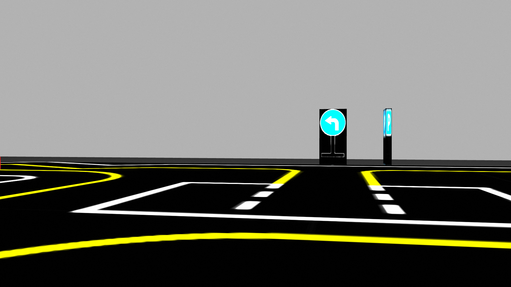
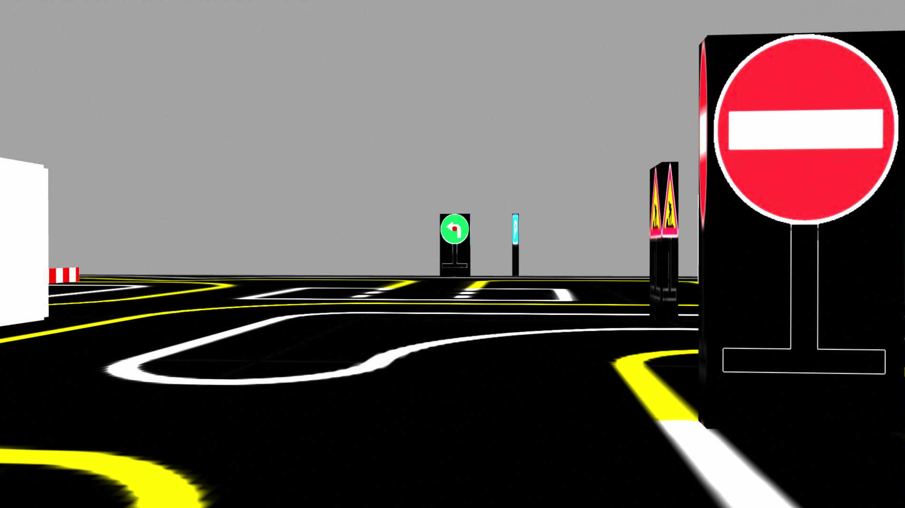

# Lab Assignment 5 – Color Target Detection
## ECE-CSE 434 - Autonomous Vehicles


# Preparation

Start by reading the following sections of the [Autonomous Vehicles](https://gitlab.msu.edu/av/autonomous-vehicles) repo:
 * **[3.5. Multiple Threads in ROS and OpenCV](https://gitlab.msu.edu/av/autonomous-vehicles/-/blob/2025/ROS/Multiple_Threads_OpenCV.md)** 
 * **[4.1. Logistic Regression](https://gitlab.msu.edu/av/autonomous-vehicles/-/blob/2025/AV/Logistic_regression.md)** 

This lab should mostly be done on HPCC except for the physical robot component which will use the control workstations.  

## Create a Virtual Environment and Install `sklearn`
The `sklearn` Python package will be used for logistic regression.  To install it you will need a virtual environment.  If you are using the HPCC (and not control workstation) start by entering your ROS Humble docker image by calling `ros_shell` and sourcing `.rosinit`. Then, if you have not already done so, create a virtual environment called `av` in your `~/av/venvs` folder as follows:
```bash
jazzy:dmorris@amr-184:~$ mkdir -p ~/av/venvs
jazzy:dmorris@amr-184:~$ cd ~/av/venvs
jazzy:dmorris@amr-184:~/av/venvs$ python3 -m venv av --system-site-packages
```
Now from any location you can activate your environment as follows:
```bash
jazzy:dmorris@amr-184:~$ act av
source /mnt/home/dmorris/av/venvs/av/bin/activate
(av) jazzy:dmorris@amr-184:~$ 
```
The `(av)` at the start of the line shows that your virtual environment is active.  Now with `av` active, install `sklearn` with:
```
python -m pip install "scikit-learn==1.2.2"
``` 
This will take five minutes or so to build and install.  You will need to activate `av` in any terminal you run code in for this exercise.  

## Create Your Folder for Lab 5
Create a `lab5_logr` folder in your `<student_repo>` folder.  Then copy the `code` and `data` folders and their contents from `labs_av/lab5_logr` into your `<student_repo>/lab5_logr` folder.  Run the code from within the `code` folder for exercises 1 and 2.

# Exercise 1: Exploring Higher Dimensions for Linear Classifiers (5 Points)

Create a folder called `ex1` (all lower case) in your `lab5_logr` folder and submit everything from Exercise 1 in here.

Logistic regression provides a powerful way to train a linear classifier.  In some situations this finds a solution quickly and reliably. The result is a classifier that can separate targets from clutter.  However, in sometimes the measurement data of targets and clutter are not linearly separable.  In these cases logistic regression will be unable to produce a clean separating hyperplane.  Now one way to address this problem is to expand the dimensionality of the data, either by measuring additional data or simply by transforming the already measured data.  The goal is to make the target points linearly separable from the clutter points.  This exercise explores the latter approach: transforming measured data and adding it as additional dimensions so that the targets can be identified with a linear classifier.

Two datasets are provided, each with training and testing data in the `data` folder.  In addition, code for reading the data, plotting the data and running a logistic regression classifier on it are provided.  Start with the `set_1` dataset.  The script `test_set_1.py` shows how to read in the data, plot the points, fit a classifier to the training data, apply the classifier to the test data, and plot the results.  Try it out, and make sure you understand each step of the process:
```
(av) jazzy:.../lab5_logr/code$ python test_set_1.py
```

Now look at the contents of the data class (either `train` or `test`) that were loaded.  Notice that the data are organized in N rows, with each row having 2 channels and also having a corresponding label which indicates whether it is a target or clutter point.  We can think of the 2 channels as two dimensions, and so we can plot the points on a two-dimensional plot.  

In this dataset, the points are very nearly linearly separable and so our logistic regression classifier does a good job separating target from clutter.  Notice that the precision and recall values are both high (>90%), and the Average Precision is over 99%.

**(a)** Now use the logistic regression classifier on the `set_2` dataset.  You'll need to train it on `set_2_train.csv` and report results on `set_2_test.csv`.  You should get roughly 57% Average Precision.  Output the classifier precision-recall curve to an image named `pr_set_2.png` by adding the argument `filesave='../ex1/pr_set_2.png'` to the `plot_pr_curve()` function.  

* For this part, submit `pr_set_2.png` in your `lab5_logr/ex1` folder.

**(b)** Your main assignment is to add one or more additional channels to the data that enable you to obtain over 95% Average Precision (and over 90% precision and 90% recall).  An example of adding channels is in the `add_data_channels.py` file.  Notice that the channels you add must be functions of the first two channels, `x` and `y`.  In that example, the added channels are linear functions of `x` and `y`, and do not help the overall classifier.  To improve classification you'll need to add non-linear functions of `x` and `y`.  For example, `x*x` or `(x-2)*y` etc.  Think about how you might transform the data to make two channels where the target points are linearly separable from the clutter points.  Create a new function in `add_data_channels.py` that adds your own channels.  When you try out various ideas, both the `plot_all_points()` to see points in various dimensions and `plot_hist()` to show how well target points are separated from clutter poits.  Experiment with various transformations until your Average Precision is over 95%, and precision and recall both over 90%.  Save your precision-recall curve as `pr_set_2_plus.png`

* Submit `pr_set_2_plus.png` and your updated `add_data_channels.py` file containing your function that adds new channels in `lab5_logr/ex1/`


# Exercise 2: Image-Based Target Detector (5 Points)

Create a folder called `ex2` (all lower case) in your `lab5_logr` folder and submit everything from Exercise 2 in here.  You should also activate your `av` Python environment.


The goal is to train a color-target detector that will find the centroid of a colored region in an image.  For this we'll use Logistic Regression to find pixels on the target and then connected components to find the target.

**(a)** Find target pixels using Logistic Regression.  Generally one does not train on test data, so both a training and testing image are provided in the `data` folder, along with masks identifying the targets in each.  Have a look as the images and masks to see what you'll be up against.  

Most of the code to do pixel classification and visualization is provided in `logist_reg.py`.  To run it from inside the `src` folder type:
```
python logist_reg.py ../data/train_img.png ../data/train_mask.png --testimg ../data/test_img.png --testmask ../data/test_mask.png
```
Try running this and you'll notice that it is unable to detect the target.  The reason is that the `apply()` function is incomplete.  Your task is to update this function to output the Logistic Regression score.  If you do this correctly, then you should see the above code will detect the sphere pixels.


**(b)** Finally, complete the `find_largest_target()` function so that you can run the code with the `--find-target` option.  This should use connected components to find the largest target in the image and return its centroid.
```
python logist_reg.py ../data/train_img.png ../data/train_mask.png --testimg ../data/test_img.png --testmask ../data/test_mask.png --find-target
```

* For (a) and (b), submit your updated code `logist_reg.py` as well as a folder called `ex2` with the output target detection images and model parameters in a json file.  (Note: do not import any other Python libraries.)  To output images and parameters use the `--outfolder ../ex2` option:
```
python logist_reg.py ../data/train_img.png ../data/train_mask.png --testimg ../data/test_img.png --testmask ../data/test_mask.png --find-target --outfolder ../ex2
```
This will save the coefficients to a file `logr_coefs.json`.  

# Exercise 3: On-Robot Detector (10 points)

Next, we will implement logistic regression on an image stream from the Turtlebot.

## Get your Turtlebot up and running

This exercise should be done with a simulated Turtlebot (online students) and a physical Turtlebot (in-person students).  If you will use the real robot, it is a good idea to develop your method using the simulated robot and then run on the real robot.  **For simulated robots, use ROS Humble** and your `humble_ws` workspace.

### Simulated Robot
To run a simulated bot in ROS Humble, run:
```
ros2 launch turtlebot3_gazebo turtlebot3_autorace_2020.launch.py
```
### Phsical Robot
For the physical turtlebot, turn it on and wait a few minutes for the solid white light.  Undock it so that the camera turns on.  Make sure you have your account set up on a control workstation from Lab 4 ([Control Workstation Setup](https://gitlab.msu.edu/av/autonomous-vehicles/-/blob/2025/Setup/Control_Workstations.md))


## Test the Camera

Next, confirm you can see the topics being published by the physical or simulated turtlebot with:
```
ros2 topic list
````
Can you identify the image topic?  Let's visualize the camera image.  

Start `rqt` in another terminal. If using ROS Humble, to avoid incompatible config files between Jazzy and Humble, start it with:
```
rqt --clear-config
```
Select `Plugins / Visualization / Image View`. Then refresh the topics and select the image topic.  You should be able to see the image from the camera in rqt.


## Create a ROS package

Create a Python ROS package for color-based object detection called `color_detect` inside your `<student_repo>/lab5_logr` folder.  

**(a)** Create a node in `color_detect` called `visualize`.  Its job is to subscribe to the image topic and display it in a window.  In addition, if the user presses the `s` key, it should save the current image to disk.  To get you started on this, have a look at the Example 1 code in [Multiple Threads in ROS and OpenCV](https://gitlab.msu.edu/av/autonomous-vehicles/-/blob/2025/ROS/Multiple_Threads_OpenCV.md#example-1-subscribe-to-an-image-topic).  Feel free to modify this code to make this node.  

Run node `visualize` with
```
ros2 run color_detect visualize --outim_path <path of folder where ex3_train_img.png image file will be saved> --real_robot
```
making sure to pass `--real_robot` if you're working with the physical TurtleBot4, and the relative path of the folder to save the image you will capture in the next step. This folder should be `<student_repo>/lab5_logr/data/ex3/`. The image should be saved with the name `ex3_train_img.png` for simulated robot, or `ex3_train_img_robot.png` for the real robot.

Your code should display a window with the camera image. Move the robot around using `keyboard-teleop` with
```
ros2 run turtlebot3_teleop teleop_keyboard 
```
for simulated robot in Gazebo until you see the camera view like below for a simulated Turtlebot:



Note that you will need to select the correct topic name to obtain camera image from depending whether it is a physical Turtlebot or simulated Turtlebot. Ideally, you would want to use `$ROBOT_NAMESPACE` environment variable to handle differences between physical or simulated TurtleBot. Recall, teleop on physical TurtleBot4 is achieved with:
```
ros2 run teleop_twist_keyboard teleop_twist_keyboard --ros-args -p stamped:=true --remap /cmd_vel:=$ROBOT_NAMESPACE/cmd_vel
```
or simply use the `teleop` alias to this command.

**(b)** Next we want to train a color-based detector to find either the sign post in the simulated world or a physical sign. Capture an image of your target sign using the `visualize` node as described above.

Now use the provided Python script `labeler.py` to create an object mask called `ex3_train_img_mask.png` (or `ex3_train_img_robot_mask.png` for the real robot) for the training image in `data/ex3/`. *When creating a mask around the sign, make sure to carefully select the sign color, excluding any arrows or written text from the mask.*  

 Then use `logist_reg.py` to train the detector and save parameters as `logr_coefs.json` (or `logr_coefs_robot.json` for real robot) in `data/ex3/` by running 
```
python logist_reg.py ../data/ex3/ex3_train_img.png ../data/ex3/ex3_train_img_mask.png  --outfolder ../data/ex3/
```

**(c)** Write a node `center_target` that will search for a target sign and point towards it.  It should subscribe to the same image topic, that is, the continuous stream of TurtleBot's camera feed, and do logistic regression-based object detection in the image. Your TurtleBot should keep rotating until it can detect the target in its view, and then stop once the target is in the center of its camera view. Additionally, when user presses `s` it should save the detected targets on image as `ex3_target_img.png` (or `ex3_target_img_robot.png` for real robot). An example of `ex3_target_img.png` is shown below when a simulator is used. You can use functions from `logist_reg.py` in the node for detection and visualization.  You can load the coefficients from the `logr_coefs.json` file with a little code block like this in the Node init function:
```
    # Load logistic regression model parameters
    with open(path_params, 'r') as f:
        self.get_logger().info("Load params from %s" % path_params)
        params = json.load(f)
        self.cvec = np.array(params['cvec'])
        self.intercept = np.array(params['intercept']) 
```
The way to locate the parameters is to provide the path to the file in the arguments.

Note that the `apply()` function does not require `sklearn`, so your ROS Node does not need to import `sklearn`.  



Run node `center_target` with appropriate parameters with:

```
ros2 run color_detect center_target --json_path <path to logr_coefs.json file> --outim_path <path to folder where ex3_target_img.png will be saved> --real_robot
```
using `--real_robot` if working with the physical TurtleBot4.

## Submitting Ex (3):
For (a), (b) and (c), submit your package folder `<student_repo>/lab5_logr/color_detect/` (with node scripts `visualize.py` and `center_target.py` in `color_detect/color_detect/`) as well as a folder called `lab5_logr/data/ex3` with saved images (`ex3_train_img.png`, `ex3_train_img_mask.png` and `ex3_target_img.png`) and model parameters `logr_coefs.json` for the simulated robot, and `logr_coefs_robot` for real robot files.


# Exercise 4: Improving On-Robot Detector (Optional: No Credit)

You'll notice that the `center_target.py` doesn't run very well on the physical turtlebots owing to a noticable lag in the camera feed. This is because all the processing (acquiring images, displaying, drawing mask, deciding velocity commands, etc.) is happening on the control workstations which then communicate with the TurtleBot over WiFi. This is generally slow and not a good idea for real world applications. Ideally, we would want such nodes to run on the robot's onboard computer, which eliminates any communication delays.  

Thus, for this exercise, we will perform the target centering task by running `center_target.py` ROS Node on the TurtleBot4's onboard computer. Unfortunately, these TurtleBots have limited capability since they have low-power embedded computer. But it is sufficiently powerful to handle the current target centering task. Follow the instructions here [Connecting to TurtleBot4](https://gitlab.msu.edu/av/autonomous-vehicles/-/blob/2025/ROS/Turtlebot4.md#raspberry-pi-4) to connect to TurtleBot4 RPi system.  

Once connected, we need to update the ROS env on the TurtleBot to fix some outdated packages. Create a new file called `fix_ROS_env.sh` in the home folder (that is,`~/fix_ROS_env.sh) and copy the following contents into it
```
#!/bin/bash

# This script repairs a broken ROS 2 apt environment by updating an
# expired GPG key and reinstalling the problematic catkin_pkg library on the TurtleBot4 Raspberry Pi

# It will exit immediately if any command fails.
set -e

echo "--- ROS 2 Environment Repair Script ---"
echo

# Step 1: Update the ROS 2 GPG Key to fix the expired key error.
echo "[Step 1/4] Downloading and installing the new ROS 2 GPG key..."
sudo curl -sSL https://raw.githubusercontent.com/ros/rosdistro/master/ros.key -o /usr/share/keyrings/ros-archive-keyring.gpg
echo "GPG key updated successfully."
echo

# Step 2: Update the repository source list to use the new key.
echo "[Step 2/4] Updating the apt repository source list..."
echo "deb [arch=$(dpkg --print-architecture) signed-by=/usr/share/keyrings/ros-archive-keyring.gpg] http://packages.ros.org/ros2/ubuntu $(. /etc/os-release && echo $UBUNTU_CODENAME) main" | sudo tee /etc/apt/sources.list.d/ros2.list > /dev/null
echo "Repository source list updated successfully."
echo

# Step 3: Update the package list using the new key and source.
echo "[Step 3/4] Updating the apt package list..."
sudo apt-get update
echo "Package list updated successfully."
echo

# Step 4: Reinstall the problematic package.
echo "[Step 4/4] Reinstalling python3-catkin-pkg..."
sudo apt-get install --reinstall python3-catkin-pkg
echo "python3-catkin-pkg reinstalled successfully."
echo
```  

Next, create a ROS workspace in home folder using  
```
mkdir -p ~/<student_netID>_ws/src
```  
Then cd into this using  
```
cd ~/<student_netID>_ws/src/
```  

Finally, clone your `<student_repo>/lab5_logr` into this folder. Make sure to `rm -r` any additional lab folders as TurtleBot4's RPi has limited onboard storage. Finally, build your `color_detect` package using `colcon`, and then run the `center_target.py` node. You'll notice that it performs much better now that there is no lag.

Note that it is not so easy to view GUI outputs when running on the Turtlebot.  If you wish you could publish the output image with detected target marked on it from your code, and then view this on the control workstation with `rqt`. Accordingly,make sure to comment out any `cv` windows in `center_target.py` node to make sure it doesn't try to show you image view and increase the overhead on robot's RPi.   

