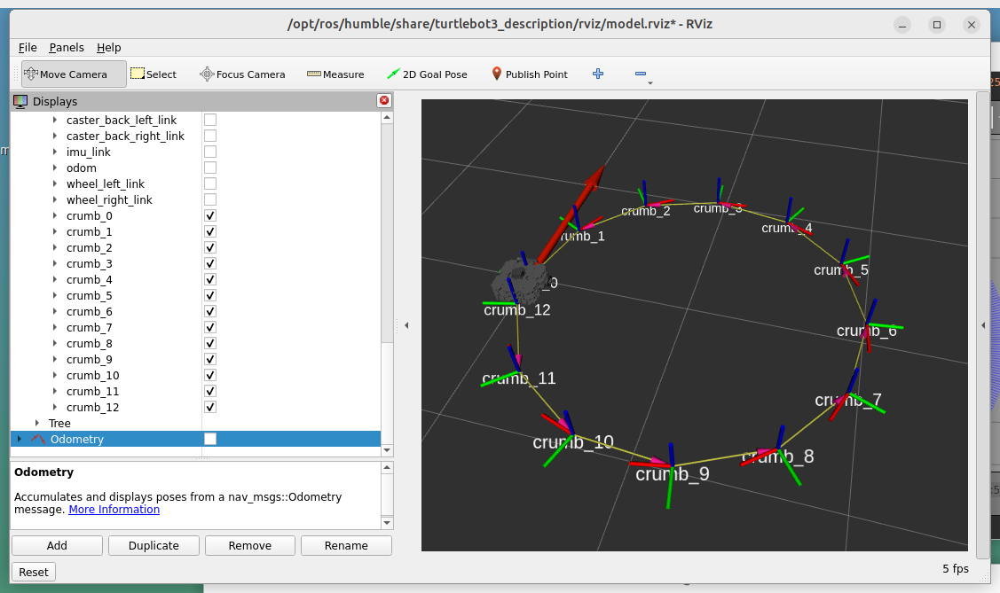
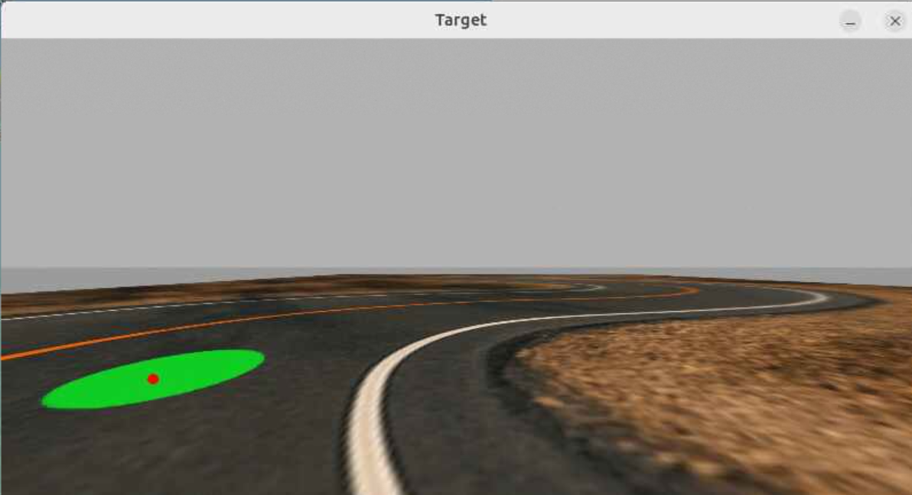
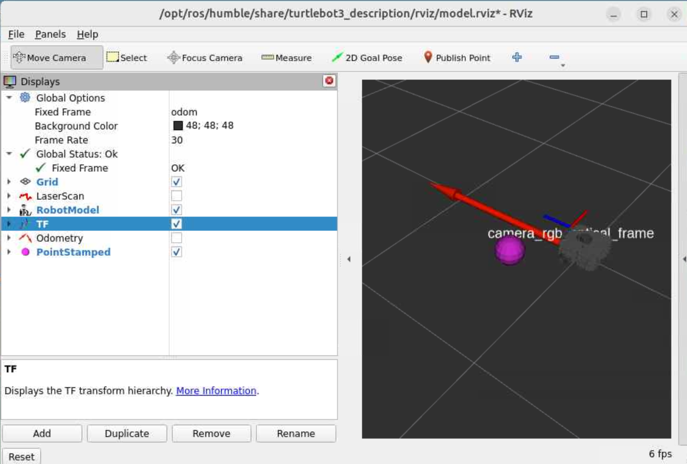

# Lab Assignment 6 – Calibration and Coordinate Frames
## ECE-CSE 434 - Autonomous Vehicles

We just released an updated version that supports plotting transform trees, so before starting your Humble shell on HPCC, do this:
```
rm ~/av/ros_humble.sif
humble_pull
```

# Exercise 1: Intrinsic Camera Calibration (5 Points)

This exercise is to do intrinsic calibration of a Turtlebot camera.   You can either calibrate the camera of a physical Turtlebot, or calibrate the camera of a Turtlebot3 from pre-recorded data.   Ex 1 can be done in Humble or Jazzy.

If you have access to a physical Turtlebot, then you can either record a ROS bag of a calibration target, or run calibration on a live recording.  First turn on a bot, wait for it to boot and then undock it.  (The camera won't start until it is undocked).  Use `rqt` to find the image topic and confirm it is working.  Then optionally record a ROS bag of the image topic while you tilt and move a checkboard in front of the camera as explained in the lecture.  

Next, do intrinsic calibration using either a pre-recorded ROS bag or a live view of a calibration target.  Instructions are available in [4.2 Camera Calibration](https://gitlab.msu.edu/av/autonomous-vehicles/-/blob/2025/AV/camera_calibration.md).  

Make a subfolder `ex1` and submit the `ost.txt` file that you created and that contains the camera parameters.  Do **not** submit the huge `calibrationdata.tar.gz` file or the images from this file.  Also submit in this folder a text file called `fov.txt` containing the following text with values you obtained from calibration, and the field of view that you should calculate yourself:
```
X focal length (pixels): <value_here>
Width of image (pixels): <value_here>
Horizontal fov (deg):    <value_here>
```

**Important**: On control workstations, after you complete this exercise, immediately delete the file: `/tmp/calibrationdata.tar.gz` with the command:
```
rm /tmp/calibrationdata.tar.gz
```
This enables other people to save their calibration data to the `/tmp` folder.

# Exercise 2: Frame Crumbs (10 Points)

## Preparation for Exercise 2

Ex 2 should be done in Humble on HPCC.  

Before starting this exercise, do the following ROS turtorials.  You'll need to adapt what you learn from them to create your package. 

1. [Introducing `tf2`](https://docs.ros.org/en/humble/Tutorials/Intermediate/Tf2/Introduction-To-Tf2.html)
2. [Writing a Static Broadcaster](https://docs.ros.org/en/humble/Tutorials/Intermediate/Tf2/Writing-A-Tf2-Static-Broadcaster-Py.html)
3. [Writing a Broadcaster](https://docs.ros.org/en/humble/Tutorials/Intermediate/Tf2/Writing-A-Tf2-Broadcaster-Py.html)
4. [Writing a Listener](https://docs.ros.org/en/humble/Tutorials/Intermediate/Tf2/Writing-A-Tf2-Listener-Py.html)
5. [Adding a Frame](https://docs.ros.org/en/humble/Tutorials/Intermediate/Tf2/Adding-A-Frame-Py.html)

## Notes: 
* In the above tutorials, **do not** install packages with `sudo apt-get install`, and there is no need to use `rosdep` as all the packages are pre-installed on the control workstations and HPCC.
* This exercise will take much more effort than Exercises 1, so budget your time accordingly.
* You can use the file `crumbs_outline.py` as a starting point for your `crumbs.py` code

## What to do

Recall the bot-monitor from Lab 4; how it plotted bread-crumbs showing the trajectory of the vehicle.  In this exercise you will record the trajectory of the Turtlebot by publishing ROS frames instead of plotting anything.  You can see the frames in RViz.  One might call these frames `crumbs`, that record the pose of the vehicle at fixed spatial intervals.  Below is a figure showing the concept.  As the vehicle moves in an arc, every time its `base_footprint` travels 0.5 meter from the previous `crumb` it publishes a new `crumb` at its `base_footprint`.  The child is the new crumb and the parent is the previous crumb (arrows point from child to parent).  The names should increment by 1 each time a new crumb is created like this `crumb_0`, `crumb_1`, ... etc.   It is best to *uncheck* `odometry` in the left panel, as that will show lots of large red arrows.



## More details
For this exercise, create a ROS package called `frames` and a node called `crumbs`.  Your node will publish the frame crumbs that mark the pose of the robot `base_footprint` as it moves.  

The node does not need to subscribe to anything.  Rather, it should initialize a `tf2_ros.static_transform_broadcaster.StaticTransformBroadcaster` for publishing the frame crumbs. It also needs
to initialize `tf2_ros.buffer.Buffer` and `tf2_ros.transform_listener.TransformListener` to obtain frame transforms. 

Use a timer to periodically call a function that will use the buffer to call `lookup_transform` to find the transform of the current `base_footprint` from the previous crumb, like this:
```
    t = self.tf_buffer.lookup_transform(
            from_frame,
            "base_footprint",
            rclpy.time.Time())
```
Here `from_frame` is `odom` initially and then the parent crumb frame.  When the magnitude of the translation in this transform, `t`, exceeds 0.5m, then using the static broadcaster, publish the transform as the next crumb with its parent being the previous crumb and its `child_frame_id` set as the name of the new crumb.  Make sure to keep a list of all the transforms up to the current point and publish the list, not just the last transform.

It is always a good idea to use the logger `self.get_logger().info('informative text here')` to record when you publish each new frame.

To run your code, first launch Gazebo with
```
ros2 launch turtlebot3_gazebo empty_world.launch.py
```
Then you can run Rviz simply by calling `rviz2` and adding the `TF` topics, or if you want to see the Turtlebot model like shown above, then you can start RViz with:
```
ros2 launch turtlebot3_bringup rviz2.launch.py
```
You might want to uncheck some of the TF frames. Run your code with:
```
ros2 run frames crumbs
```
Drive your Turtlebot in a 1 meter radius circle with this:
```
ros2 topic pub /cmd_vel geometry_msgs/msg/Twist '{linear: {x: 0.1}, angular: {z: -0.1}}' -1
```
Stop the Turtlebot with:
```
ros2 topic pub /cmd_vel geometry_msgs/msg/Twist '{}' -1
```
Capture a screenshot of the Rviz window.  Make sure to show the names of the crumbs but turn off display of the internal Turtlebot frames for easier viewing.  

To check that everything is working, have a look at the transform tree using `rqt`.  Go to `Plugins / Visualization / TF Tree`.  If you don't see this plugin, then you need to update your Humble shell -- see above.  Your transform tree should show all the crumbs as frames.

**Submit** the `frames` package including `crumbs.py`.  Also in a subfolder called `ex2`, save a screenshot called `crumbs.png` (like I took above) of your Turtlebot leaving frame crumbs in a circle.  

# Exercise 3: Ground Spot (10 Points)

Ex 3 should be done in Humble on HPCC.  You can use `ground_spot_outline.py` as a starting point for your `ground_spot.py` code.

One way to estimate the 3D location of a target on the ground is by finding the intersection between a ray to the target and the horizontal ground surface.  The math describing how to do that is in the following figure.  Here you will create a ROS node called `ground_spot` in the `frames` package that implements this.


Start by cloning the [Curvy Road World](https://gitlab.msu.edu/av/curvy_road) into your Humble workspace on HPCC.  You can build and run it as described in the Readme file.  The goal is to detect the green ground spot and in the image and publish a 3D point relative to the robot at the center of the dot.  Here's an example of detecting the green spot in the image using logistic regression:



Start by using logistic regression to create a ground spot detector.  Save your coefficients in a file `logr_coefs.json` in folder `ex3`.  Your node should take the path to this file as an argument to load the parameters and should subscribe to the image topic and run centroid detection on each image.  Your node should run with the command:
```
ros2 run frames ground_spot --json_path <path>/ex3/logr_coefs.json
```
where `<path>` depends on where it is being run from.

Your node must find where the ray through the center of the dot intersects the ground and that defines the ground spot 3D position.  You'll publish this point to a topic called `ground_point` of type `PointStamped`.  You can give its position in `base_footprint` coordinates, in which case it is important that the `frame_id` in the the point header is set to `base_footprint`.  That way ROS can determine the world coordinate system for the point when it plots it.  You can easily visualize the 3D point by adding `ground_point` in RViz.  
```
ros2 launch turtlebot3_bringup rviz2.launch.py
```
Adding `ground_point` will show a purple sphere at the location of the published point, as shown here:



In addition to publishing `ground_spot` when the the green disk is detected in the image, your code should display an image like that above showing its detection and detection centroid as a red dot.

Have a look at your detection and the RViz display of the 3D point when your robot turns:
```
ros2 topic pub /cmd_vel geometry_msgs/msg/Twist '{angular: {z: 0.2}}'
```
The 3D point should stay still while your robot rotates until it the green spot is at the edge of the frame.

# Exercise 4: Create a Launch File (5 Points)

It is a little annoying to have to provide the path to your `json` file to run the node.  An alternative is to create a launch file.  This can provide arguments to your code as well as start multiple nodes, all with just one command.  Starting multiple nodes at once is very nice in reducing the number of terminal windows you need. So here let's create two launch files, one to start up the `ground_spot` node, and one to start for this and the Curvy Road package.  

Start by reading this [tutorial on launch files](https://docs.ros.org/en/jazzy/Tutorials/Intermediate/Launch/Creating-Launch-Files.html).  Focus on Python launch files as these are the most powerful.  

Now let's create our own launch file.  In the top level of your `frames` package, create a folder `launch` and copy the provided  launch files here.  Typically launch files go in the `launch` folder.  Also create a `models` folder and copy your `logr_coefs.json` file into this.

Have a look inside `green_spot_launch.py` and make sure you understand how it works.  Only one node is launched, but it is possible to launch more nodes from this file.

Next we need to ensure both the `models` folder and `launch` folder are copied to the install folder during `colcon build`.  For this add the following to the `setup.py` file:
```
import os
from glob import glob
```
and update the `data_files=[]` statement to include the files in the `launch` and `models` folders:
```
    data_files=[
        ('share/ament_index/resource_index/packages',
            ['resource/' + package_name]),
        ('share/' + package_name, ['package.xml']),
        (os.path.join('share', package_name, 'launch'), glob('launch/*launch.py')),
        (os.path.join('share', package_name, 'models'), glob('models/*.json')),
    ],
```

Your `package.xml` file should include:
```
  <exec_depend>ros2launch</exec_depend>
```
Now build your package with `colcon build`, source the `setup.bash` file, and then try:
```
ros2 launch frames green_spot_launch.py
```

Now, launch files can launch other launch files.  Have a look inside `green_spot_world_launch.py`.  It calls first the launch file `curvy_world.launch.py` and then the `green_spot_launch.py` file.  Quit both Gazebo and your running package.  Then try:
```
ros2 launch frames green_spot_world_launch.py
```
In this way we can start up all the packages, including Gazebo, in one command.  

Your assignment is to create a launch file named `crumbs_launch.py` that will start Gazebo with an empty world, Rviz with a Turtlebot model, and the crumbs node.  To find the packages and launch files you'll need, have a look in [3.3 Gazebo Simulator](https://gitlab.msu.edu/av/autonomous-vehicles/-/blob/2025/ROS/Gazebo_Simulator.md).

Your submission for this exercise is both the `crumbs_launch.py` file and the updates to the `frames` package so that the launch files all work.

# Submitting this lab
Your ROS package and files should all be inside your `<student_repo>/lab6_tf` folder.  Here is what we are expecting using the command `tree lab6_tf`:
```
lab6_tf
├── ex1
│   ├── fov.txt
│   └── ost.txt
├── ex2
│   └── crumbs.png
├── ex3
│   ├── logr_coefs.json
└── frames
    ├── frames
    │   ├── crumbs.py
    │   ├── ground_spot.py
    │   ├── __init__.py
    ├── launch
    │   ├── crumbs_launch.py
    │   ├── green_spot_launch.py
    │   └── green_spot_world_launch.py
    ├── LICENSE
    ├── models
    │   └── logr_coefs.json
    ├── package.xml
    ├── resource
    ├── setup.cfg
    ├── setup.py
    └── test
```
There may be additional files, but these are the required ones.

