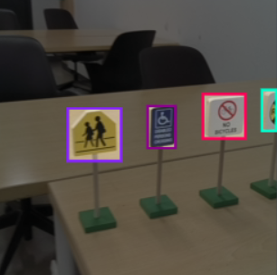
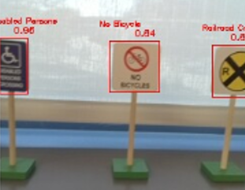

# Lab 7: Object Detection with YOLO
## ECE-CSE 434

Object detection is a key perception task used by autonomous vehicles to understand their local environment and support trajectory planning including manuvering around obstacles. [YOLO](https://pjreddie.com/darknet/yolo/) (You Only Look Once) is a widely used nueral network model for object detection. The goal of this lab is to go through the whole process of building a custom detector leveraging a standard model and custom data. You will train a YOLO detector to detect traffic signs from captured images on Turtlebot.  

This lab can be done on the control workstations or on HPCC with Jazzy (using `ros_shell`).  With the control workstations you can use the physical Turtlebots or pre-recorded ROS bags available here: `/egr/courses/ECE/434/Shared/yolo_bags/` and `/egr/courses/CSE/434/Shared/yolo_bags/`. On HPCC you can use pre-recorded ROS bags available `/mnt/research/ece_cse_434/yolo_bags/`.  If you have made a symbolic link to the data as explained in earlier labs, you'll find these bags here: `~/av/data/yolo_bags`.

# Exercise 1: Collect Training Images (5 Points)

We will be using the model traffic signs stored in the lab or cabinets.  The first step is to gather training data of the signs.  You'll want to gather multiple views of each sign from different angles and distances, and ideally different backgrounds.  There are quite a few different signs, and it is only required that you discriminate 10 different signs, although you can do more if you wish.

## Option 1: Collect your own ROS bags
For training data, arrange at least 10 different signs in a row and record 2 ROS bags with different background while moving Turtlebot 4 in front of the traffic signs.  You can teleoperate the Turtlebots or simply pick them up to more easily get a wide range of views of the signs.

Collect data in your `~/av` folder, not in your repo.  The bags will be too large to push onto Gitlab.
```
ros2 bag record -o bag_train_yolo1 /bot##/oakd/rgb/preview/image_raw
ros2 bag record -o bag_train_yolo2 /bot##/oakd/rgb/preview/image_raw
```
where `##` is your botID.

Note: if you do not have enough storage space on your home folder for the ROS bags, then you can record your ROS bags to the `/tmp` folder on the control workstation.  In that case, you should give the bags a name that includes your NetID to avoid over-writing someone else's bags.

## Option 2: Use the provided ROS bags
Alternatively, you may use the provided ROS bags: `~/av/data/yolo_bags/bag_train_yolo1` and `~/av/data/yolo_bags/bag_train_yolo2`.

## Gather Image Data
Next, gather images of the signs from the ROS bags.  You'll do this by playing the ROS bags and using a ROS node to save individual images.

To play a bag with looping do:
```
ros2 bag play <bag_name> -l
```
Inside `<student_repo>/lab7_yolo`, create a ROS package called `yolo_det`, and a node file called `sample_img.py` in the package. The node subscribes to topic `/bot##/oakd/rgb/preview/image_raw` and displays real-time image when a recorded ROS bag is being played. It will save current image to specified folder and name it as timestamp (e.g. `20251009_1630.png`) when key `s` is pressed. Use this node to gather a good selection of sign images from both your ROS bags and make sure your collected images capture every traffic sign from different perspectives and distances.

Submit your package `yolo_det` with node code `sample_img.py`.

### IMPORTANT:  
You might want to use `NAMESPACE` as in previous labs when subscribing to the camera image to write a generic ROS node. However, exercise caution when using `NAMESPACE` with ROS bags, as the bags might encode the `botID` in the camera topic of the specific TrutleBots they were created with.  This is okay, you just need to account for it in your saving node.

___
# Exercise 2: Create YOLO Dataset (5 Points)
Use a webpage based labeling software ([roboflow](https://roboflow.com/)) to annotate your collected images. First create an account and a new project. Second, follow the workflow of the software to upload data, annotate images with 2D bounding boxes and class names and generate a version of your dataset.  
**NOTE:** Use `Traditional` tool and NOT the `Rapid` tool when creating your project.  
Then, split your dataset with 80% for training and 20% for validation. A reference of names of traffic signs can be found [here](https://www.epermittest.com/michigan/road-signs). The figure shows examples of bounding box labels. The dataset should include at least 10 different classes.



Finally download dataset as YOLOv11 format and unzip the dataset file. The dataset should contain two folders (`train/` and `valid/`) and `data.yaml`.
```
traffic_sign_dataset/
        train/
                images/
                labels/
        valid/
                images/
                labels/
        data.yaml
```

Submit your created dataset folder in your repo as: `lab7_yolo/traffic_sign_dataset`.  Note: normally you would not include a dataset in a Git repo, but since this is a very small dataset it is okay.

___
# Exercise 3: Train a YOLO Detector (5 Points)
Let's create a clean virtual Python environment called `yolo` to ensure all package dependencies are met. 
```
cd ~/av/venvs
python3 -m venv yolo
```
Next, activate your virtual environment with:
```
act yolo
addpypath yolo
```
The first of these activates the environment so you can install packages in it.  The second, `addpypath yolo`, adds this environment to your `PYTHONPATH` environment variable, which is required for ROS to use packages in this environment.

We will use the python package [`Ultralytics YOLO`](https://docs.ultralytics.com/) to train a YOLO 2D detector with our custom dataset. `Ultralytics YOLO` has the latest YOLO models, pretrained weights from standard datasets and training functions. First install PyTorch (CPU version) and Ultralytics in your `yolo` virtual environment alongwith all the dependencies.

Run the following installations with your `yolo` environment activated:
```
pip install --upgrade pip
pip install jinja2 setuptools==58.2.0 pyyaml typeguard
pip3 install torch torchvision  --index-url https://download.pytorch.org/whl/cpu
pip install ultralytics
pip install opencv-python==4.6.0.66
pip install numpy==1.26.4
```
### IMPORTANT:  
Calling `addpypath yolo` is needed so ROS can see your environment, but **do not** try to `colcon build` after calling this. For that, open another terminal.

## Prepare Training Data
Next, to make your dataset compatible with `ultralytics`, create a new .yaml file named `sign.yaml` modified from `data.yaml` in your dataset folder following [Ultralytics YOLO format](https://docs.ultralytics.com/datasets/detect/). Note `path` in Ultralytics YOLO format is the path to the dataset folder (absolute path or relative path to your training script). Your dataset folder now becomes 
```
traffic_sign_dataset/
        train/
                images/
                labels/
        valid/
                images/
                labels/
        data.yaml
        sign.yaml
```
## Train Your Model
Now, create a training script directly inside `lab7_yolo` called `train.py`, in which you apply the train function from ultralytics.  Here's the code:

```python
from ultralytics import YOLO
import os

# Load a model
model = YOLO("yolo11n.pt")

yaml_file_path = os.path.expanduser('/your/path/to/sign.yaml')   # This would ideally be ~/av/<student_repo>/lab7_yolo/traffic_sign_dataset/sign.yaml. os.path.expanduser() can read `~` and convert it to the absolute home path.

# Train the model
train_results = model.train(
    data=yaml_file_path,  # path to sign.yaml in your dataset
    epochs=400,           # number of training epochs
    imgsz=256,            # training image size
    device="cpu",  
)

```
Run your `train.py` and training results (weights and figures) will be save in `lab7_yolo/run/detect/train/`.  Have a look in that folder at the convergence plots from training.  Also, find the trained weights called `best.pt`.  Keep these here, and you'll need these for Ex. 4.

Submit the figure `PR_curve.png` in your `lab7_yolo/` folder.  
**NOTE:** You might get `BoxPR_curve.png` instead of `PR_curve.png`. If so, rename it to `PR_curve.png` and submit.

___
# Exercise 4: Run YOLO Detector on TurtleBot 4 through Control Workstations (5 Points)
The following example code loads weights and applies the model on one image. More detailed documents on inference can be found [here](https://docs.ultralytics.com/modes/predict/).
```python
from ultralytics import YOLO

model = YOLO(weight_path)  # load weights in train results, e.g. runs/detect/trainxx/weights/best.pt

# detect an image
results = self.model(img,        # img may be numpy array, opencv image or image path
                     imgsz=256,  # image size
                     conf=0.1)   # threshold of confidence

xywh_np = results[0].boxes.xywh.numpy()  # bounding box center (x,y) and width/height; shape (n_box, 4)
conf_np = results[0].boxes.conf.numpy()  # confidence scores; shape: (n,)
cls_np = results[0].boxes.cls.numpy()    # class indices; shape (n,)

```

## Create a Detection Node
In your ROS package `yolo_det`, create a node file called `det_img.py`. The node subscribes to topic `/bot##/oakd/rgb/preview/image_raw`, performs detections and displays real-time images with 2D bounding boxes, class name as well as confidence score plotted on top of the images (as shown below). You may test your `det_img` on a recorded ROS bag (playing in a loop) before deploying on the TurtleBots.



You can use `cv2.rectangle` to plot bounding boxes and `cv2.putText` to put class names and confidence scores.  Your node should run with the command:
```
ros2 run yolo_det det_img --weights_dir <path_to_weights>
```
Here `<path_to_weights>` if the relative or else full path of the weights folder containing `best.pt`.  

## In-person Students:
Do this on the control workstations using camera data from the real TurtleBots.

## Online Students:
You may use provided ROS bags on HPCC for detection and visualization:
```
ros2 bag play ~/av/data/yolo_bags/bag_test_yolo -l
```

Submit the node file `det_img.py` as part of your `yolo_det` package, and a screenshot of your visualization of detections on top of images called `sign_visualization.png` in the `lab7_yolo/` folder.

If you wish you can add and commit the `runs` folder with your weights to your repo.  For large models you would not do this as the weights will be huge, but here they are relatively small, so it's okay.

___
# Exercise 5: (Optional) Run YOLO Detector on TurtleBot 4 to detect and center the STOP sign (5 points bonus)
For this exercise, you're going to use the ROS node from Lab 5 and the detector you created in Ex 4, and create a new ROS node called `find_and_center_sign.py`. It should achieve the following  
- Keep turning to find the STOP(in-person students)/Left Turn(online students) sign
- As soon as the STOP(in-person students)/Left Turn(online students) sign is detected using YOLO detector that you trained, it should center sign in the camera's FOV and stop.
- Pressing `s` should save the camera image overlaid with the bounding box on the STOP(in-person students)/Left Turn(online students) sign with confidence score on top.

Run your node with
```
ros2 run yolo_det find_and_center_sign --weights_dir <path_to_weights>
```


## In-person students:
You need to run this on the TurtleBot itself. Before doing anything, follow the instructions from Lab 5 Exercise 4: [Improving On-Robot Detector](https://gitlab.msu.edu/labs/labs_25/-/tree/main/lab5_logr?ref_type=heads#exercise-4-improving-on-robot-detector-optional-no-credit) to update the ROS installation on the TurtleBots and fix some outdated packages. 

Then paste the following at the end of your `~/.bashrc` file on the RPi:
```
# Command to activate selected virtual environment:
VENV_FOLDER=$HOME/av/venvs                                     # Change this as appropriate
act() {
  if [ $# -eq 0 ] 
  then
    ls $VENV_FOLDER                       # If no arguments, display all virtual environments
  else
    cmd="source $VENV_FOLDER/${1}/bin/activate"   # Activate selected virtual environment
    echo $cmd
    eval $cmd
  fi
}
# The following will enable ROS nodes to access packages installed in a
# virtual environment.  Activating a virtual environment with the act 
# command is insufficient for ROS Python to use it.  Instead use: addpypath
addpypath() {
  if [ $# -eq 0 ] 
  then
    ls $VENV_FOLDER                       # If no arguments, display all virtual environments
  else
    pyversion=`/usr/bin/ls $VENV_FOLDER/${1}/lib`
    newpath=$VENV_FOLDER/${1}/lib/$pyversion/site-packages
    echo 'Appending $PYTHONPATH:'"$newpath"
    cmd="export PYTHONPATH=$PYTHONPATH:$newpath"   # Activate selected virtual environment
    eval $cmd
  fi
}
```  
to enable the commands `act yolo` and `addpypath yolo` on TurtleBot's RPi.

Follow the instructions from the Exercise 3 above to set up a venv with Ultralytics working. Create your own ROS workspace with `mkdir -p ~/<NetID>_ws/src` using your own NetID.  You can then clone your student repo into the `src` folder of this workspace on the TurtleBot's RPi.  This will contain the trained YOLO model weights along with other scripts to avoid retraining the model.  


### IMPORTANT:  
Since you'd be connecting to the TurtleBot4 remotely over SSH, graphic `CV` windows could not be forwarded. So make sure you don't spawn any in your `find_and_center_sign` node. Just focus on detecting and centering.  

Submit the node file `find_and_center_sign.py` as part of your `yolo_det` package, and the camera image with the bounding box overlaid on top of the required sign in `lab7_yolo/` folder renaming it to `centered_sign.png`. Since there wouldn't be a `CV` window running on TurtlrBot4, run this node on the corresponding control workstation and submit the camera image you save from there.

## On-line Students:
You need to run this in the Gazebo `autorace` environment in `ROS:Humble`. Spawn it by running:
```
ros2 launch turtlebot3_gazebo turtlebot3_autorace_2020.launch.py
```

You will need to train a new YOLO model following the previous steps in this lab on the following signs in the `autorace` environment:
- Right Turn (cyan)
- Left Turn (cyan)
- Do Not Enter
- Traffic Intersection
- Traffic Construction
- Stop

Your `find_and_center_sign.py` ROS node should find and center the `Left Turn` sign in its camera's FOV.

Submit the node file `find_and_center_sign.py` as part of your `yolo_det` package, and the camera image with the bounding box overlaid on top of the required sign in `lab7_yolo/` folder renaming it to `centered_sign.png`.

# Exercise 6: (Optional and only for fun) Create a launch file (0 points)

You learned how to make launch files in Lab 6.  Here create one so that you can launch your code with:
```
ros2 launch yolo_det det_img_launch.py
```
You could create a folder in `yolo_det` called `weights` and put `best.pt` there.  Then follow a similar process to that in Lab 6 so that these weights are copied into the `install` folder and your code can find and load these weights by their location relative to the package location.

# Folder Structure for Submission  
Before submitting this lab, make sure your directory structure looks like this:  
```
lab7_yolo/
├── sign_visualization.png
├── centered_sign.png
├── PR_curve.png
├── traffic_sign_dataset
│   ├── data.yaml
│   ├── sign.yaml
│   ├── train   [will have images and labels in it]
│   └── valid   [will have images and labels in it]
├── train.py
└── yolo_det
    ├── package.xml
    ├── resource
    ├── setup.cfg
    ├── setup.py
    └── yolo_det
        ├── __init__.py
        ├── det_img.py
        ├── sample_img.py
        └── find_and_center_sign.py  [optional Ex 5]
```
You can run the following command from inside your `<student_repo>` to print this and verify your files.  Any misnamed or mislocated files will receive 0 points.
```
tree lab7_yolo/
```  
There could be some additional files in there, but above is what and how we require the structure to be to grade this lab.
