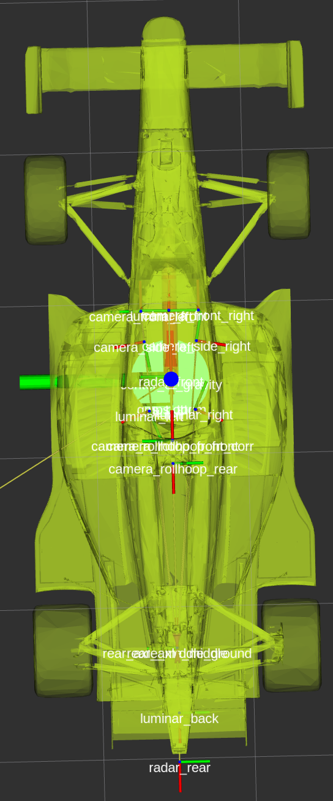
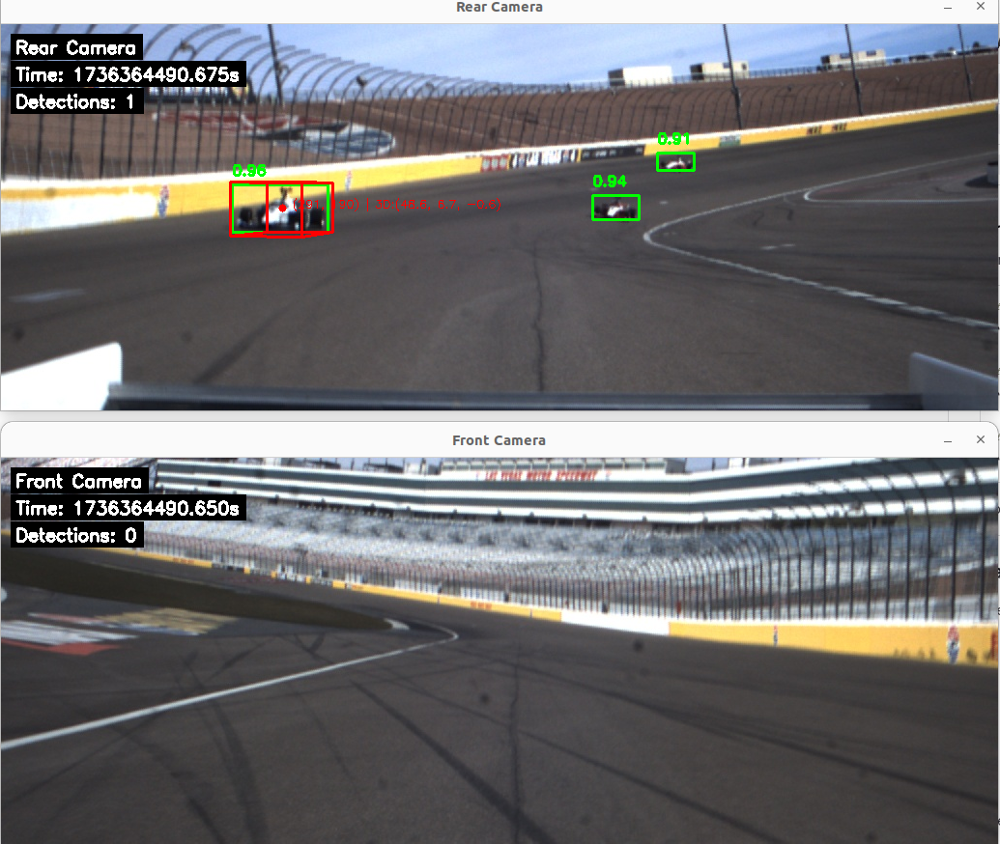
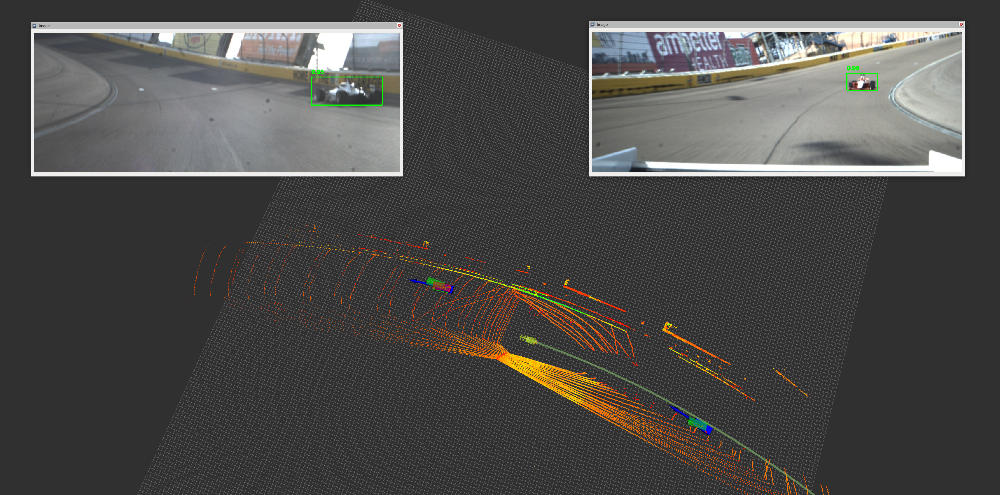

# Lab 8: Multi-Object Tracking with Camera Projection

## Summary

This lab consists of three progressive exercises that build upon each other:

### **Exercise A – Core Multi-Object Tracking (Required)**
Implement the fundamental tracking algorithms in `tracking_node_skeleton.py`:
- Track initialization from LiDAR detections  
- Constant speed motion model for prediction
- Data association using cost matrices
- Kalman filter measurement updates
- Track management (creation, confirmation, deletion)

**Expected behavior**: Tracks objects visible to LiDAR with gaps behind the ego vehicle where the sensor has limited coverage.

### **Exercise B – Camera-LiDAR Sensor Fusion (Extra Credit)**  
Extend your Exercise A solution to incorporate camera detections:
- Enable camera fusion parameters in the config file
- Handle higher measurement noise from camera detections
- Improve tracking coverage, especially in the rear quadrant
- Balance detection recall vs. precision through parameter tuning

**Expected behavior**: More complete tracking coverage with some additional noise, particularly behind the ego vehicle.

### **Exercise C – Camera Projection Visualization (Extra Credit)**
Implement 3D-to-2D projection functions in `tracking_node_skeleton_plus_projection.py`:
- Transform 3D track positions from LiDAR to camera coordinate frames
- Project 3D bounding boxes onto camera image planes  
- Handle coordinate frame conversions between ROS and OpenCV conventions
- Visualize tracking results overlaid on camera images

**Expected behavior**: Real-time display of tracking bounding boxes projected onto front and rear camera feeds.

**Reference Images:**

| TF Tree (Coordinate Frames) | Example Projection | RViz Visualization |
|:--------------------------:|:------------------:|:------------------:|
|  |  |  |


- `sparc_tracking/image/static_tf.png` - Shows the TF coordinate frame relationships you'll need
- `sparc_tracking/image/Projection.png` - Example of successful 3D-to-2D projection results  
- `sparc_tracking/image/rviz.png` - Expected RViz visualization of tracking outputWelcome to the ROS 2 tracking and computer vision lab! This comprehensive guide covers multi-object tracking implementation, camera-LiDAR fusion, and 3D-to-2D projection for visualization. You'll build a complete tracking system that can process LiDAR detections, track objects over time, and project tracking results onto camera images for enhanced visualization. 8: Multi Opponent Tracking

Welcome to the ROS 2 tracking lab. This guide explains how to build the workspace, implement the tracker skeleton, record your results, and prepare the deliverables you will submit for grading.

---

## Before You Begin

1. **Environment** — Use a ROS 2 Jazzy workstation (Ubuntu 24.04) with a standard colcon workspace. All commands below assume the workspace root is `~/av/ros_ws` and that you have sourced the appropriate ROS setup files.
```
ros_shell
```

2. **Initializing the ROS2 Environment** 

```
source ~/.rosinit
```

---

## Package Layout (`sparc_tracking`)

```
 sparc_tracking/
 ├── config/tracking_params.yaml                      # Default node parameters
 ├── launch/tracking.launch.py                        # Launch tracker, optional RViz & bag playback
 ├── rviz/tracking.rviz                              # Visualization preset
 ├── image/                                          # Reference images

 ├── sparc_tracking/
 │   ├── tracking_node_skeleton.py                  # Basic tracker skeleton (Exercises A & B)
 │   └── tracking_node_skeleton_plus_projection.py  # Extended skeleton with projection (Exercise C)
 ├── package.xml
 ├── setup.py / setup.cfg
 └── README.md                                       # This guide
```

Your implementation work occurs in one of the skeleton files, depending on which exercises you complete. Both files provide complete ROS interfaces while leaving the core algorithms as TODOs.

---

## Assignment Flow

1. **Exercise A – LiDAR-only tracking**  
  Implement the TODO sections using only the LiDAR detections. Expect gaps behind the ego vehicle because the rear portion of the point cloud is absent.
2. **Exercise B – Sensor Fusion upgrade (optional for extra credit)**  
  Integrate the camera detections by enabling the camera fusion flags. The cameras increase detection rate—especially behind the ego car—but introduce noisier position estimates.
3. **Exercise C - Camera Projection (Optional for extra credit)**
  Project detections into the images
---

## Deliverables

Your submission must include:

### **Required (Exercise A):**
1. **Implementation**: `tracking_node_skeleton.py` with all TODOs completed and the node running without exceptions
2. **Parameters**: The YAML configuration file used for your final evaluation  
3. **Data**: CSV file generated from evaluation run with `enable_csv_logging: true`
4. **Documentation**: Short reflection (≈1 page) covering:
   - Parameter tuning process and rationale
   - Observed trade-offs between precision and recall
   - Performance analysis and failure modes
   - Whether sensor fusion was attempted

### **Extra Credit Additions:**
- **Exercise B**: Updated implementation with camera fusion enabled, including fusion-specific parameter choices
- **Exercise C**: `tracking_node_skeleton_plus_projection.py` with projection TODOs completed, plus screenshots or video showing successful projection visualization


---

## Building the Package

From the workspace root (`~/av/ros_ws`):

```bash
colcon build --packages-select sparc_tracking
source install/setup.bash
```

Re-run the `source` command in every new terminal window where you plan to launch ROS nodes.

---

## Running Your Implementation

During development typically work from individual terminals:

```bash
# Terminal 1 – tracker (choose appropriate version)
# For Exercises A & B:
ros2 run sparc_tracking tracking_node_skeleton
# For Exercise C:
ros2 run sparc_tracking tracking_node_skeleton_plus_projection

# Terminal 2 – bag playback
ros2 bag play ~/av/data/iac_bags/tracking_topics_bag  

# Terminal 3 – visualization
rviz2 -d $(ros2 pkg prefix sparc_tracking)/share/sparc_tracking/rviz/tracking.rviz

# Terminal 4 – (Exercise C only) monitor camera image topics
ros2 run rqt_image_view rqt_image_view
```

Stop playback with `Ctrl+C` in the terminal running `ros2 bag play`.

---

## Parameter Reference

The YAML file `config/tracking_params.yaml` exposes the major tuning knobs.

- `r_pos`, `q`, `r_asso` — Measurement and process noise scalars.
- `update_threshold`, `coast_threshold`, `coast_threshold_confirmed` — Track promotion and pruning thresholds.
- `track_max_age` — Maximum age (seconds) before a track is dropped.
- `filter_rate` — Nominal filter tick frequency.
- `use_camera`, `r_camera`, `r_asso_camera` — Enable/adjust camera fusion.
- `pointcloud_topic`, `camera*_topic` — Incoming ROS topics. Update these if your sensors publish elsewhere.
- `enable_csv_logging`, `csv_output_path` — Control logging of confirmed tracks.
- `display_images` — Enable/disable camera image windows (Exercise C only).
- `front_camera_topic`, `rear_camera_topic` — Camera image streams for projection (Exercise C only).

## Coordinate Frames and Camera Projection (Exercise C)

Understanding the coordinate frame relationships is crucial for successful 3D-to-2D projection:

### **Key Coordinate Frames**
- **`center_of_gravity`**: Primary LiDAR/tracking coordinate frame (ego vehicle center)
- **`camera_rollhoop_front`**: Front camera coordinate frame  
- **`camera_rollhoop_rear`**: Rear camera coordinate frame

### **TF Relationships** 
The system uses static transforms to define spatial relationships between sensors.  
Reference image below for the complete TF tree structure that your projection functions will navigate:

<p align="center">
  
</p>

### **Camera Calibration Parameters**
Both cameras use identical intrinsic parameters:
- **Focal length**: fx = fy = 1731.270 pixels
- **Principal point**: cx = 530.000, cy = 170.000 pixels  
- **Resolution**: 1032 × 400 pixels
- **Distortion**: Minimal (set to zero for this lab)

### **Coordinate Convention Conversion**
Your projection implementation must handle the coordinate system differences:
- **ROS convention**: x-forward, y-left, z-up
- **OpenCV convention**: x-right, y-down, z-forward

Override individual parameters at launch time:
```bash
ros2 launch sparc_tracking tracking.launch.py \
  params_file:=/path/to/custom.yaml \
  play_bag:=false
```
Note: In unix if you put a `\` at the very end of the line (right before the return character), then the next line is considered a continuation of the current line.  The above could all be put in one line without the `\` characters.

## Constant Speed Motion Model

Model the tracked vehicle as moving with constant linear speed and constant angular speed.  The linearized equations for this are summarized below.  Use these equations for propagating the state and for propagating the covariance.  The equations for predicting and updating the covariance are in the lecture slides.


---

## Working with the Code Skeletons

### **Core Tracking Functions (Both Skeleton Files)**
Implement these fundamental algorithms:
- **Track initialization**: Create new tracks from unassociated detections
- **Motion prediction**: Constant-speed model with covariance propagation  
- **Measurement projection**: Map track state to observation space (`build_predicted_measurement`)
- **Data association**: Cost matrix construction and likelihood computation
- **Kalman update**: Measurement incorporation and state refinement

### **Camera Projection Functions (Extended Skeleton Only)**
For Exercise C, additionally implement:
- **3D bounding box computation**: Generate corner points in 3D space
- **Coordinate transformation**: Convert between LiDAR and camera frames using TF2
- **2D projection**: Map 3D points to image pixel coordinates using camera intrinsics
- **Visualization**: Overlay tracking results on camera images

### **Sensor Characteristics to Consider**
- **LiDAR**: Provides accurate 3D positions within its field of view, but the evaluation bag lacks coverage directly behind the ego vehicle
- **Cameras**: Offer 360° detection capability but introduce higher positional uncertainty when projected to the LiDAR coordinate frame
- **TF frames**: Reference `image/static_tf.png` to understand coordinate frame relationships for Exercise C

### **Key Implementation Tips**
- Start with Exercise A to establish stable LiDAR-only tracking before attempting fusion
- Use conservative parameters initially, then tune for performance vs. false positive trade-offs  
- For Exercise C, pay careful attention to coordinate frame conventions (ROS vs. OpenCV)
- Test projection functions with known points before integrating with the tracker

---

## Visualizing Outputs

### **Camera Projection (Exercise C)**
- **Live overlay**: Real-time bounding box projection on camera feeds
- **Image topics**: Monitor front/rear camera streams with tracking overlays

<p align="center">
  
</p>

- **Reference**: See above for successful projection examples

### **RViz Visualization**
- **Bounding boxes**: 3D track representations (`/sparc/point_pillars/tracks`)
- **Direction arrows**: Track heading indicators  
- **Overlay text**: Track statistics and counts (`/sparc/point_pillars/overlay_text`)

<p align="center">
  
</p>

- **Reference**: See above for expected appearance

### **Debugging Tools**
- **TF frames**: `ros2 run tf2_tools view_frames` or check `image/static_tf.png` for frame relationships
- **Console logs**: Formatted track state tables printed during operation  
- **Topic inspection**: `ros2 topic echo` and `ros2 topic hz` for data flow verification

### **Data Logging**
- **CSV output**: Incremental track logging when `enable_csv_logging: true`
- **Format**: Timestamp, track ID, position, velocity, orientation, and metadata
- **File permissions**: Ensure output directory is writable

---

## Collecting CSV Results

Grading is driven by CSV comparisons between your tracker output and the provided ground-truth trajectories.

1. Enable logging in `config/tracking_params.yaml`:
  - Set `enable_csv_logging: true`.
  - Point `csv_output_path` to a writable location (e.g., `/tmp/student_tracks.csv`).
2. Run your tracker on the evaluation bag. The node appends one row per confirmed track update.
3. Submit the CSV called `track_log.csv` alongside a short reflection called `reflection.md` in Markdown format describing parameter choices and whether camera fusion was enabled.

The evaluation script automatically discards estimates outside the $\pm 80\,\text{m}$ longitudinal window in front of and behind the ego vehicle before computing errors.

---


## How You’ll Be Graded

Your submission is evaluated in three parts (100 pts total):

1. **Implementation Completeness (20 pts)** — All TODOs in `tracking_node_skeleton.py` are resolved, the node launches cleanly, and logging stays functional.
2. **Tracking Performance (10 pts)** — Using LiDAR-only, the position RMSE inside the $\pm 80\,\text{m}$ window must be $\leq 1.5\,\text{m}$ for full credit (partial credit down to $2.5\,\text{m}$). Track persistence inside the window should cover at least 70% of ground-truth objects (partial credit down to 50%).
3. **Reflection (5 pts)** , and your reflection explains parameter choices, trade-offs, and observed failure modes.

### **Extra Credit Opportunities**

**Exercise B - Camera Fusion (up to +5 pts)**: Integrate camera detections for improved tracking coverage. Enable camera fusion only after achieving stable LiDAR-only performance.

**Exercise C - Camera Projection (up to +5 pts)**: Implement 3D-to-2D projection for enhanced visualization. Requires coordinate frame transformations and camera calibration understanding. 

---

## Quality Checklist

Expected outputs can be confirmed with:
```
python check_folder.py check lab8_tracking/ lab8_tracking_tree.json
```
The file structure is:
```
lab8_tracking
├── README_tracking.md
├── reflection.md
├── sparc_tracking
│   ├── config
│   │   └── tracking_params.yaml
│   ├── image
│   │   ├── Projection.png
│   │   ├── rviz.png
│   │   └── static_tf.png
│   ├── launch
│   │   └── tracking.launch.py
│   ├── package.xml
│   ├── resource
│   │   └── sparc_tracking
│   ├── rviz
│   │   └── tracking.rviz
│   ├── setup.cfg
│   ├── setup.py
│   └── sparc_tracking
│       ├── __init__.py
│       ├── tracking_node_skeleton.py
│       └── tracking_node_skeleton_plus_projection.py
└── track_log.csv
```

### **Exercise A (Required)**
- ✅ `colcon build --packages-select sparc_tracking` completes successfully
- ✅ `tracking_node_skeleton` launches without exceptions  
- ✅ RViz markers visible when bag plays (reference: `image/rviz.png`)
- ✅ Console logs show active track information
- ✅ CSV logging produces well-formed output when enabled
- ✅ RMSE ≤ 1.5m in ±80m evaluation window

### **Exercise B (Extra Credit)**  
- ✅ Camera fusion parameters properly configured
- ✅ Improved tracking coverage behind ego vehicle
- ✅ Balanced performance between precision and recall

### **Exercise C (Extra Credit)**
- ✅ `tracking_node_skeleton_plus_projection` launches without exceptions
- ✅ Camera image windows display with overlaid bounding boxes
- ✅ Projections appear correctly aligned (reference: `image/Projection.png`)
- ✅ Real-time performance maintained during projection

## Troubleshooting Common Issues

- **No tracks appearing**: Check detection topics and parameter thresholds
- **TF lookup failures**: Verify static transforms are published and frame names match
- **Projection misalignment**: Double-check coordinate frame conventions and camera parameters
- **Performance issues**: Reduce image display frequency or disable projection during development

Happy tracking and projecting! 🛰️📡🎥
