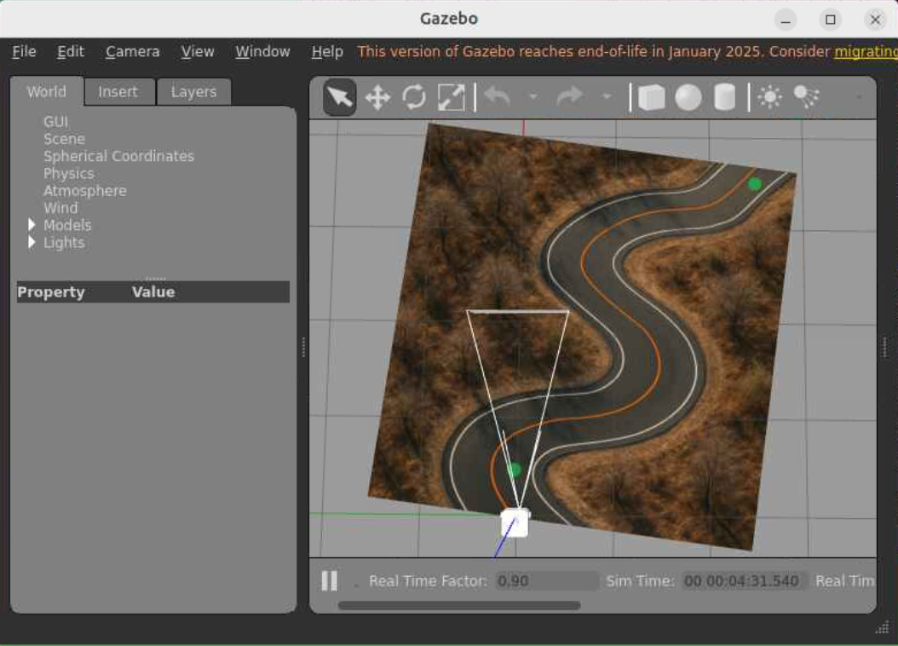
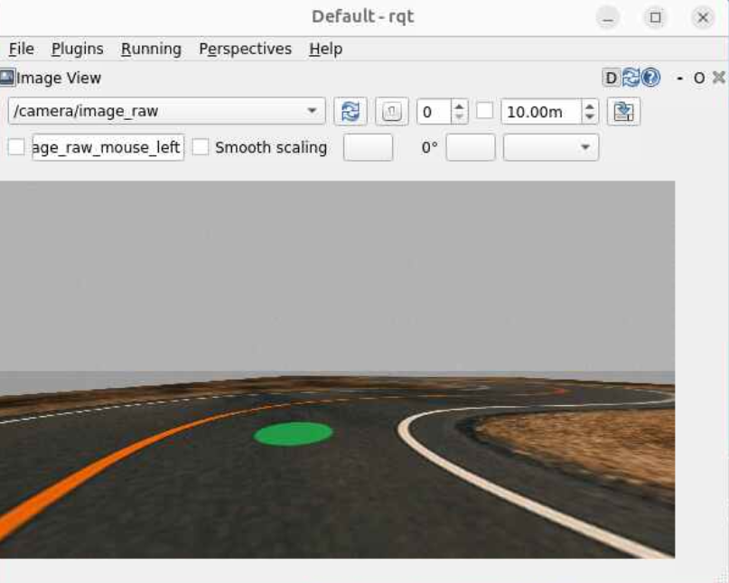

# Lab 9: Lane Detection and Following
## ECE-CSE 434

A basic feature of any autonomous vehicle is the ability to stay in a lane while driving along a road.  This lab will develop a simplified form of lane following in which a Turtlebot detects a lane on the ground, computes its center, and follows it. 

Start by learning about feedback control by reading and doing the exercises in [Autonomous Vehicles / 4.4 PID](https://gitlab.msu.edu/av/autonomous-vehicles/-/blob/2025/AV/PID.md).  We'll do this in-class.  


Lab 9 will be done in Gazebo, and can be done on the HPCC using the `humble_shell` environment.  Clone [Curvy Road World](https://gitlab.msu.edu/av/curvy_road) into your workspace src folder, such as: `~/av/humble_ws/src/`.  Do not download it into your `<student_rep>` folder.  Then build it and run it following the instructions.  If you already have `curvy_road` in your workspace, make sure to **pull the latest version**, as the starting pose of the robot has been updated.




# Exercise 1: Lane Detection (10 Points)

You can view the camera image with `rqt` or with Rviz.  You should see the starting viewpoint of the robot looking like below.  If it is not, then pull the latest from the `curvy_road` repo.



We will use color to distinguish the lane markings from the rest of the ground texture.  The question is how to find a suitable rule for distinguishing the white (on the right) and orange (on the left) line pixels from other pixels?  If you recall, that is what our logistic regression classifier did. While it works well when the colors and their constrasts to be detected are consistent, it often fails in more complex real-world scenarios. We need a method that can detect and isolate colors in a range, which is where `OpenCV` comes in. Read more about various methods to track a certain colored object and image thresholding [Image Processing in CV](https://docs.opencv.org/3.4/d2/d96/tutorial_py_table_of_contents_imgproc.html).  

Since there's a pretty good contrast between the (black) road and lane markings, using `cv2.inRange` should suffice to create a mask and detect the lane markings. You can choose to work in either `BGR` or `HSV` color-space. Use appropriate color ranges for your selected color-space. Ideally you should take pictures of the road through the robot's camera_view from various angles and locations, and then use a simple color picker tool to get the color ranges for lane marking. For the current simulation taks however, a conservative range should be good enough. You can also create binary masks using thresholding in CV (`cv2.threshold` or `cv2.adaptiveThreshold`) if you feel `cv2.inRange` is insufficient to give you good masks.  

Create a python ROS package called `lane_follow` and a ROS node `detect.py` to write your lane detection algorithm. Your lane detection logic could be as follows:  
* Isolate the bottom 10-20% of image marking that as your Region of Interest (ROI)
* Detect the two lane markings and find their centroid in the ROI (you can use further use mophological operations `cv2.morphologyEx` for noise reduction in the mask)
* Convert these to full image coordinates
* To handle sharp turns (the robot camera might not have a wide enough field of view), you can keep a memory of the lane width. Based on which lane marking has gone out of view, you can figure out the kind of turn (left or right) and approximate the lane center using the lane width from memory, until both lane markings are in view again. (Remember to keep updating the lane width memory when both lane markings are detected)  

Your `detect` node should do the following:  
* Subscribe to the image topic from the robot,
* Perform lane detection and find the lane center to follow,
* Display a red dot at the lane center and publish this processed image to `/image_processed` topic for viewing, and
* Publish the lane center coordinates to the topic `/lane_point` as a PointStamped message type (set the header of `/lane_point` to be the same as the subscribed image message).
* Detect the end of the curvy road by checking if both lane markings are absent from your ROI and publishing (0,0,0) to the `/lane_point`.

You can teleoperate the robot in the curvy road environment with the `detect` node running and viewing `/image_processed` in `rqt` to verify if your lane detection works well. It should be able to handle the sharp turns. Save an image `lane_detected_turn.png` with the detected lane center at one of the turns when one of the lane markings (either left-orange or right-white) is not in view.
 
For this exercise, submit the following:
* `detect.py` in `<sudent_repo>/lab9_lane/lane_follow/lane_follow`
* `lane_detected_turn.png` in `<sudent_repo>/lab9_lane/`


# Exercise 2: Follow the Lane using PID (10 Points)

Now that you have the detected lane center, create a lane follower using a [PID controller](https://gitlab.msu.edu/av/av_24/-/blob/main/AV/PID.md) with the objective of keeping the detected lane center in the horizontal center of the image.  Your node should be called `follow_pid` and run with
```
ros2 run lane_follow follow_pid
```
It should subscribe to `/lane_point` and publish a `Twist` to `/cmd_vel`.  Choose a constant linear velocity, and use PID to determine the angular velocity.

When your robot reaches the end of the curvy road (indicated by all-zeros in `/lane_point`), it should record the time taken, stop, and print out the following lines with the values used
```
Kp:
Ki:
Kd:
Linear Velocity:
Time to complete: 
```

The goal is to drive along the curvy road as fast as possible (minimizing the time to complete).  We'll have a friendly competition to see who can complete the course in the minimum time.  You can tune the PID parameters to optimize your performance.

Create a text file called `pid_params.txt` with the above output from your code.

For this exercise, submit:
* `follow_pid.py` in `<sudent_repo>/lab9_lane/lane_follow/lane_follow`
* `pid_params.txt` in `<sudent_repo>/lab9_lane/`.

# Exercise 3: Follow the Lane using Pure Pursuit (10 Points) 

Pure pursuit plans an arc through a target point ahead of the robot along its path.  Let's project the image-based lane center to a ground point, and use this.  Remember that in Lab 6 we did that projection for the green dot.  Here we are projecting the lane center instead of the green dot.   You can either modify your `ground_spot.py` code from lab 6 or use the provided `ground_spot.py` to do this projection.  The main difference with Lab 6 is that this subscribes to `/lane_center` rather than the image and finding the green dot.  Add this as a node to your package and make sure it runs with:
```
ros2 run lane_follow ground_spot
```
View the ground spot with Rviz:
```
ros2 launch turtlebot3_bringup rviz2.launch.py
```
Then add the `/ground_point` topic, and you should see a purple dot at the ground spot in front of the Turtlebot:


With the lane center in the robot's base_footprint frame being published to `/ground_point`, create a lane follower using a Pure Pursuit Algorithm.  Your node should be called `follow_pure_pursuit` and run with
```
ros2 run lane_follow follow_pure_pursuit
```
It should subscribe to `/ground_point` and publish a `Twist` to `/cmd_vel`.  Choose a constant linear velocity, and use pure pursuit algorithm to determine the angular velocity. **Note** that the lookahead distance `d` is no more a tunable parameter since we only have the desired `ground_point` instead of a desired path.

When your robot reaches the end of the curvy road, it should record the time taken, stop, and print out the following lines with the values used
```
Linear Velocity:
Time to complete: 
```
You can detect the end of the curvy road the same way as in Exercise 2.
The goal is to drive along the curvy road as fast as possible (minimizing the time to complete).  As before, we'll have a friendly competition to see who can complete the course in the minimum time.  To optimize your performance, you can tune the linear velocity and the ROI in `detect` (to alter the lookahead distance `d`) .

Create a text file called `pp_params.txt` with the above output from your code.

For this exercise, submit:
* `follow_pure_pursuit.py` in `<sudent_repo>/lab9_lane/lane_follow/lane_follow`
* `pp_params.txt` in `<sudent_repo>/lab9_lane/`.

# Submitting this lab
Your ROS package and files should all be inside your `<student_repo>/lab9_lane` folder.  Here is what we are expecting using the command `tree lab9_lane`:
```
lab9_lane
├── lane_detected_turn.png
├── pid_params.txt
├── pp_params.txt
└── lane_follow
    ├── lane_follow
    │   ├── detect.py
    │   ├── ground_spot.py
    │   ├── follow_pid.py
    │   ├── follow_pure_pursuit.py
    │   ├── __init__.py
    ├── LICENSE
    ├── package.xml
    ├── resource
    ├── setup.cfg
    ├── setup.py
    └── test
```
There may be additional files, but these are the required ones.
